基于Springboot的学生综合素质评价系统（程序+论文）
=

### 完整代码获取地址：从戎源码网 ([https://armycodes.com/](https://armycodes.com/))
### 作者微信：19941326836  QQ：952045282 
### 承接计算机毕业设计、Java毕业设计、Python毕业设计、深度学习、机器学习
### 选题+开题报告+任务书+程序定制+安装调试+论文+答辩ppt 一条龙服务
### 所有选题地址https://github.com/nature924/allProject

一、项目介绍
---

基于SpringBoot框架的学生综合素质评价系统，系统角色为系统管理员、辅导员、老师和学生，主要功能如下

系统管理员：
基本操作：登录、退出、修改密码、获取个人信息、修改个人信息
用户管理：筛选用户信息、查看用户信息详情、新增用户、修改用户、删除用户、重置密码、获取用户会话信息
学生管理：筛选学生信息、获取学生列表、查看学生信息详情、新增学生信息、修改学生信息、删除学生信息
教师管理：筛选教师信息、获取教师列表、查看教师信息详情、新增教师信息、修改教师信息、删除教师信息
辅导员管理：筛选辅导员信息、获取辅导员列表、查看详情、新增/修改/删除
公告管理：发布公告、获取公告列表、查看公告详情、修改公告、删除公告
留言管理：获取留言列表、新增留言、查看留言详情、修改留言、删除留言
综合素质管理：个人综合素质（gerenzonghesuzhi）和专业/院系综合素质（zhuanyezonghesuzhi）的列表、查看、录入、编辑、删除

辅导员：
基本操作：登录、退出、修改密码、获取个人信息、修改个人信息
学生管理：筛选/查看/新增/修改/删除其负责范围内的学生、批量导入学生
公告管理：查看公告列表、查看公告详情（可发布/管理视权限而定）
留言管理：查看留言列表、回复或管理留言
综合素质管理：查看/录入/编辑其负责范围内的综合素质记录
文件管理：上传下载文件

老师：
基本操作：登录、退出、修改密码、获取个人信息、修改个人信息
学生管理：筛选/查看/编辑其负责范围内的学生信息
公告管理：查看公告列表、查看公告详情
留言管理：查看和管理留言
综合素质管理：查看/录入/编辑教师相关的综合素质评价条目
文件管理：上传下载文件

学生：
基本操作：注册、登录、退出、修改密码、获取/修改个人信息、忘记密码重置
个人信息：查看/编辑个人资料（包括照片）、查看个人会话信息
公告与留言：查看公告列表与详情、发布或查看留言（视权限）
综合素质：查看个人综合素质记录
文件管理：上传个人相关文件（如头像）、下载已上传文件

二、项目技术
---
- 编程语言：Java
- 数据库：MySQL
- 项目架构：B/S架构
- 前端技术：JSP
- 后端技术：Spring、SpringMVC、MyBatis

三、运行环境
---
- 操作系统：Windows、macOS都可以
- JDK版本：JDK1.8以上都可以
- 开发工具：IDEA、Ecplise、Myecplise都可以
- 数据库: MySQL5.7以上都可以
- Tomcat：任意版本都可以
- Maven：任意版本都可以

四、运行截图
---
### 论文截图：
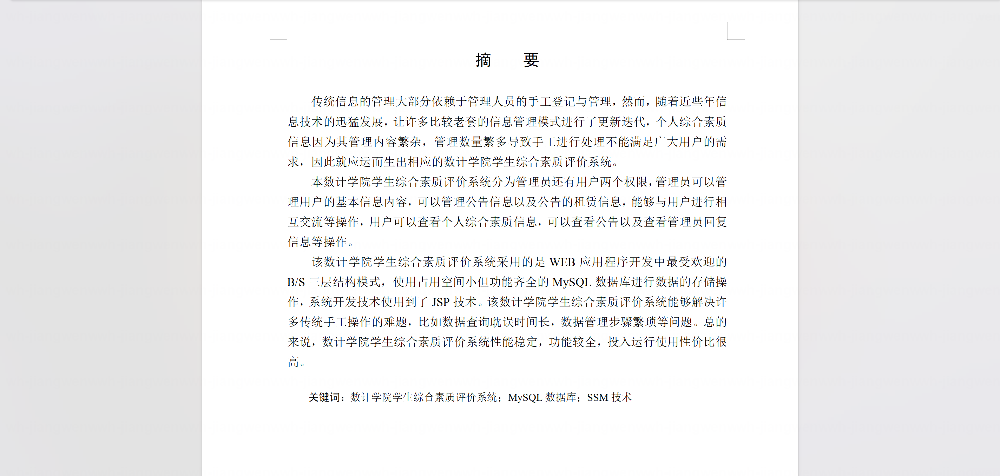
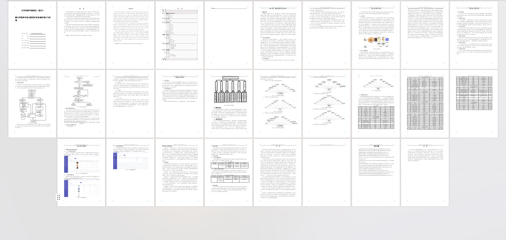

### 程序截图：
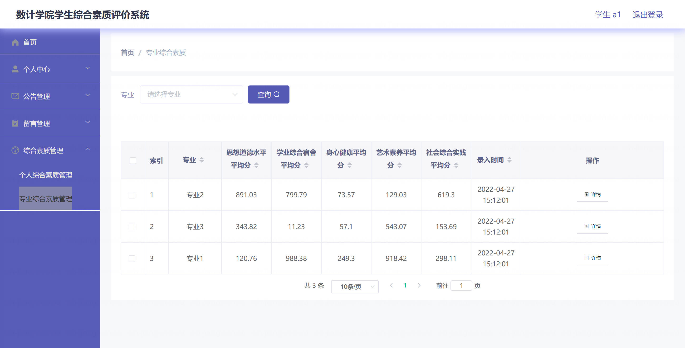
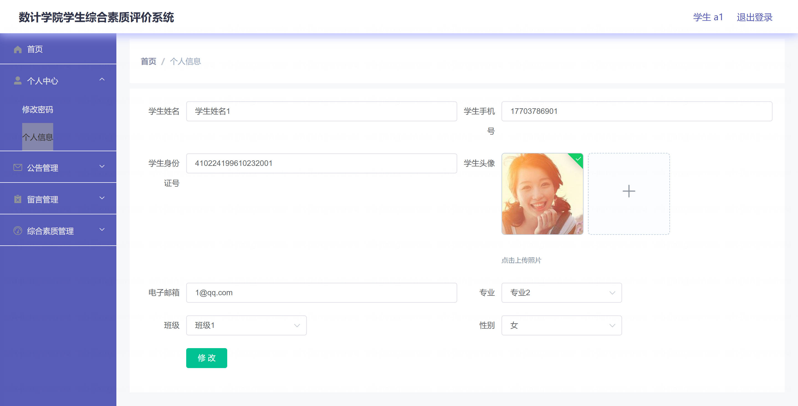
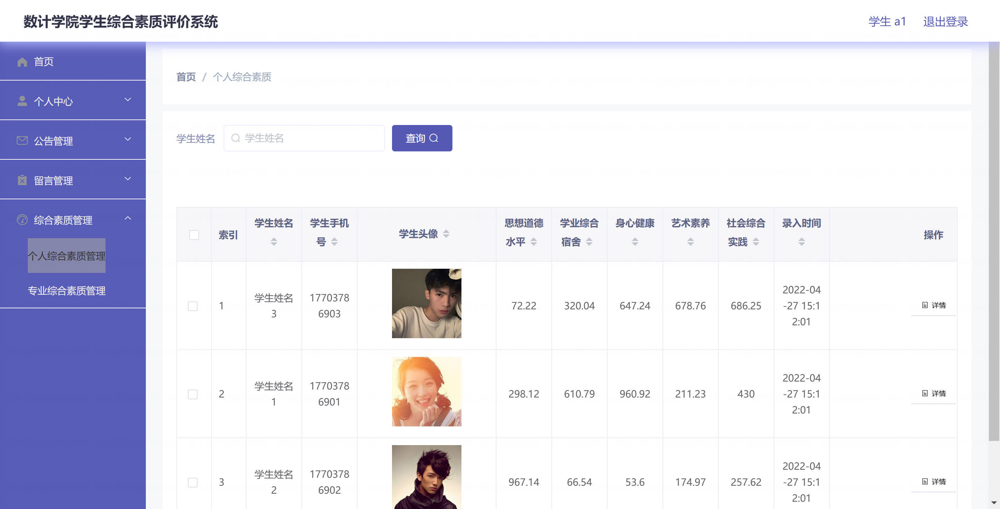
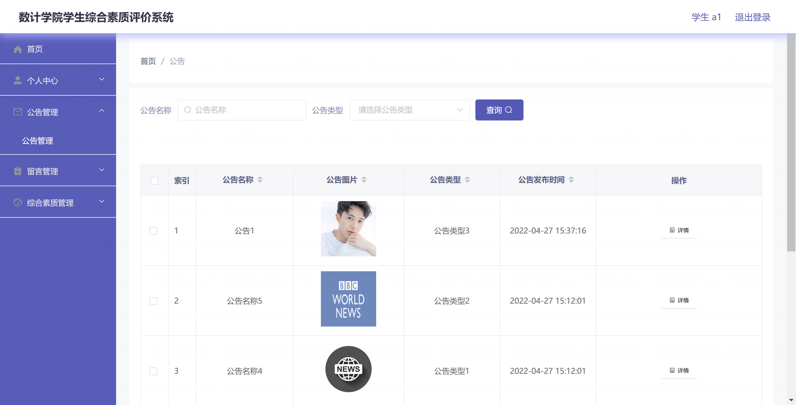
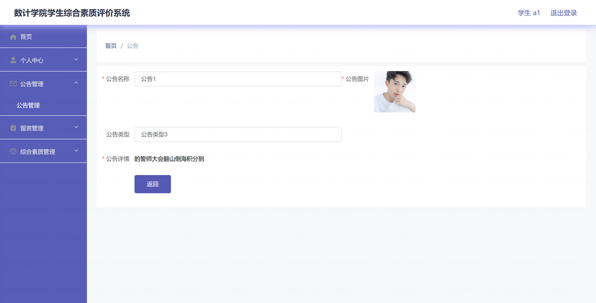
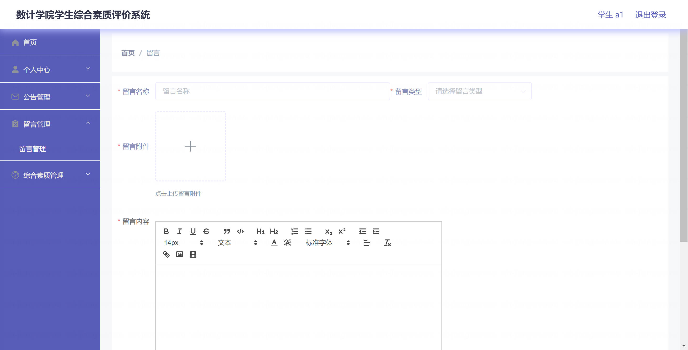
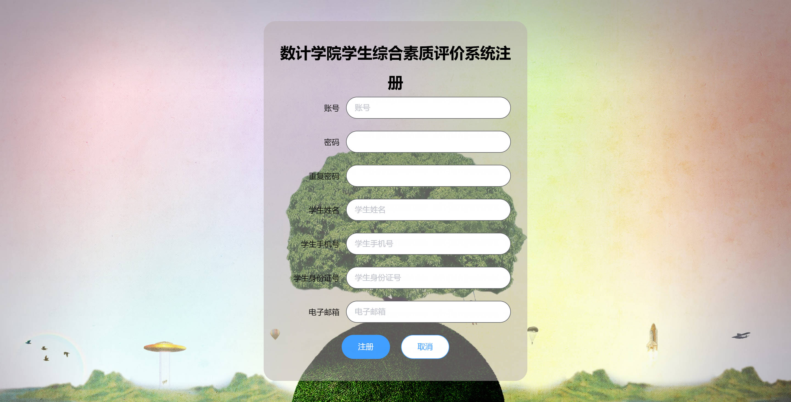
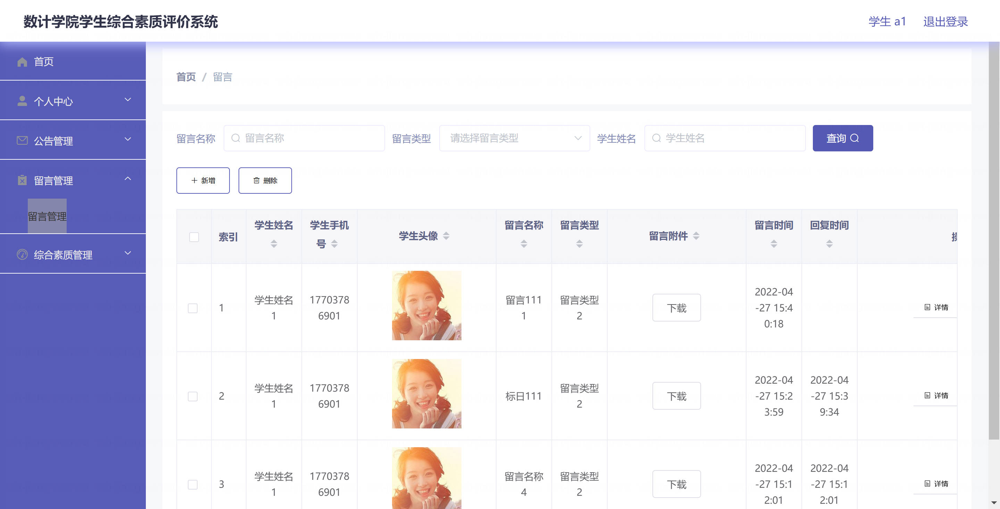
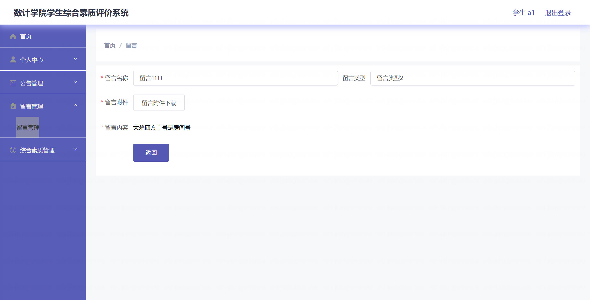

